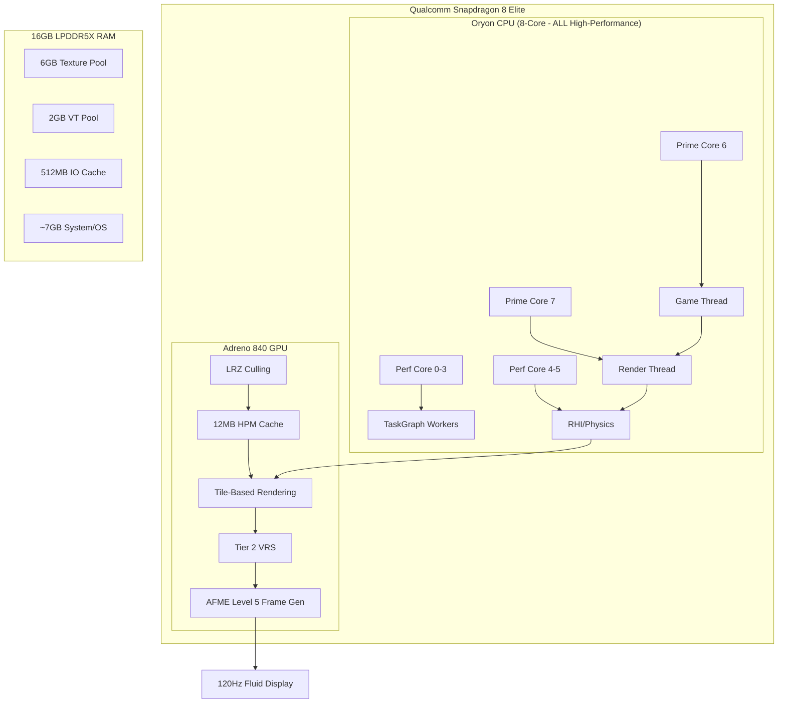
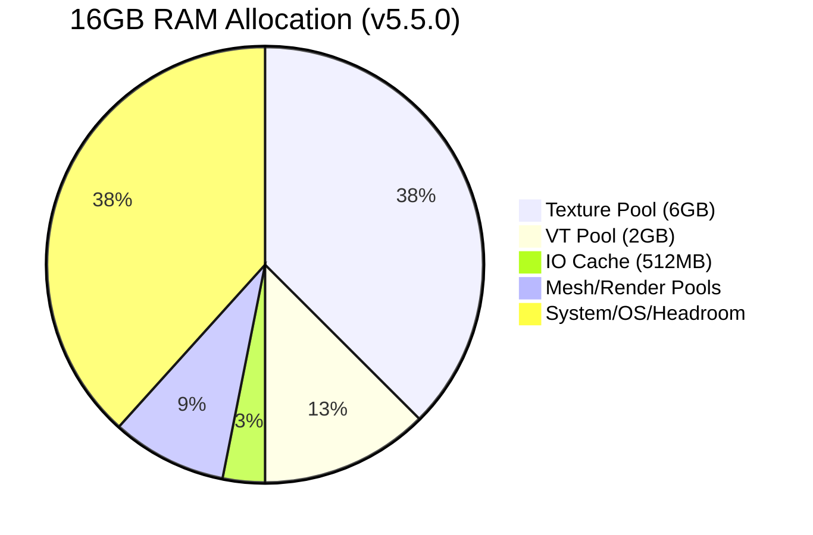

# Wuthering Waves: Ultimate Configuration Architecture
### Senior UE4 Graphics Tech Lead Blueprints for Snapdragon 8 Gen 5 (Adreno 840)

This document defines the authoritative architectural blueprint for the **v5.5.1 Ultimate Edition** configuration. It serves as both a technical reference and a safeguard against misconfiguration.

---

## What's New in v5.5.1 (Reviewed Experimental)

**Code Review Approved** 4 experimental optimizations after rigorous analysis:

### Approved Changes
- **ParallelBeginFrame**: Parallel frame start logic (lower GT/RT latency)
- **HalfPrecisionAlbedo**: FP16 albedo for 2x ALU throughput on Adreno
- **GC Exclusion**: Skip 200K permanent objects (eliminates micro-stutters)
- **VT Pool Scale**: 1.5x virtual texture cache (reduces pop-in)

### Rejected by Reviewer
- **DynamicRendering**: May conflict with Subpass Merging (both optimize TBDR)
- **DistanceFieldShadows**: Too heavy for mobile, CSM is sufficient

---

## What's New in v5.5.0 (Phase 1+2 Comprehensive)

**6-Agent Research Analysis** uncovered 75+ optimization opportunities. This release implements the highest-impact changes:

### Adreno 840 Hardware Features
- **LRZ (Low-Resolution Z)**: Hardware occlusion before fragment shading (+15-25% fragment throughput)
- **UBWC**: Universal Bandwidth Compression for LPDDR5X
- **Subpass Merging**: 30% bandwidth reduction in deferred shading
- **Wave32 Mode**: Better register occupancy on Adreno 8xx
- **Per-Thread Command Pools**: Eliminates lock contention

### GPU Scene & Instancing
- **GPU Scene**: Massive CPU relief for draw calls
- **Indirect Drawing**: Vulkan 1.3 indirect draw calls
- **4096 Instances/Draw**: Doubled batch sizes

### Threading & Parallelism
- **Expanded Core Affinity**: Now uses ALL 6 Performance cores (0-5)
- **TaskGraph Priority Segregation**: High/Normal/Low priority queues
- **Parallel Physics**: Background collision tick, parallel solving
- **Parallel Animation**: Bone updates on worker threads

### Memory & Streaming
- **6GB Texture Pool**: Eliminates texture thrashing (was 4GB)
- **200K Bandwidth**: Doubled for UFS 4.0 utilization
- **64 Parallel IO Requests**: Massive queue depth for fast storage
- **20x Actor Registration**: Smoother level streaming

### Niagara VFX (Critical Fix)
- **Async Tick RE-ENABLED**: SD8 Elite has NO little cores - async is now beneficial
- **GPU Parallel Compute**: Parallel compute shaders for VFX
- **2-Frame Buffering**: Reduces skill spam stutters
- **512 GPU Culling Threshold**: Earlier GPU offload

### Shadows & Lighting
- **Tuned Shadow Bias**: Eliminates acne and peter-panning
- **Front-Face Culling**: Halves geometry in shadow pass
- **48 Lights/Cluster**: Optimized for Adreno 840

---

## System Architecture Overview

---

## Frame Generation Pipeline (60 → 120 FPS)

---

## CRITICAL CONFIGURATION (DO NOT MODIFY)

**To any Agent or Developer:** Modifying the following CVars will break the 120 FPS Frame Generation architecture or cause catastrophic stability issues.

### 1. Frame Generation Integrity
| CVar | Required Value | Reason |
| :--- | :--- | :--- |
| `t.MaxFPS` | `60` | AFME Level 5 requires stable 60 FPS input to interpolate to 120. |
| `r.Kuro.AFME.Enable` | `5` | Enables hardware-accelerated "Elite" mode for Adreno 840. |
| `r.FidelityFX.FSR3.FI` | `0` | **MUST BE 0.** Enabling this causes double-interpolation (ghosting + 60ms latency). |
| `r.FidelityFX.FI.Enabled` | `0` | Disables redundant FSR3 Frame Interpolation modules. |

### 2. Synchronization & Latency
| CVar | Required Value | Reason |
| :--- | :--- | :--- |
| `r.OneFrameThreadLag` | `1` | Enables GT/RT parallelization for AFME stability. |
| `r.Vulkan.MaxFrameLatency` | `2` | Balanced queue depth for throughput + latency. |
| `r.Vulkan.CPURHIThreadFramePacer` | `0` | Internal pacer conflicts with AFME's hardware timing. |

### 3. Adreno 840 Hardware Access
| CVar | Required Value | Reason |
| :--- | :--- | :--- |
| `r.Vulkan.Adreno.HPMCacheSize` | `12288` | Allocates 12MB of on-chip memory (Adreno 840 L2 spec). |
| `r.Vulkan.Adreno.LRZ.Enable` | `1` | Hardware-level occlusion culling. |
| `r.Vulkan.EnableBindlessRendering` | `1` | Critical for offloading draw call overhead. |
| `r.Vulkan.EnableRayQuery` | `0` | **EXPERIMENTAL.** Setting to 1 causes instant crashes. |

---

## Memory Budgeting (16GB RAM Optimized)

---

## Sub-System Breakdowns

### Visual Fidelity
*   **Shadows**: 3 CSM Cascades with PCF quality tiering (5/4/3) and 300MB caching.
*   **GTAO**: Full-resolution Ground Truth Ambient Occlusion running on Async Compute.
*   **SSR**: Quality Level 2 with 0.8 Max Roughness and Temporal Filtering.
*   **Kuro Features**: Maxed Hair, Cloth (Compute Shader), and SSS light diffusion.

### Rendering Pipeline
*   **Vulkan 1.3**: Dynamic Rendering, Extended Dynamic State 2, Synchronization 2, Wave32.
*   **VRS Tier 2**: Variable Rate Shading with Foveated pattern for 10-15% GPU savings.
*   **PSO Management**: 512MB Cache with LRU eviction to eliminate traversal stutters.
*   **GPU Scene**: Full GPU-side primitive management for reduced CPU overhead.

### Threading & Logic
*   **Core Affinity**: Prime Cores (6-7) for Game/Render; ALL Performance cores (0-5) for workers.
*   **Chaos Physics**: 6 workers with parallel collision solving and background tick.
*   **Animation**: 30+ ISPC SIMD optimizations + parallel bone updates.
*   **TaskGraph**: Priority segregation (High/Normal/Low) for optimal scheduling.

### Niagara VFX
*   **Async Tick**: Re-enabled for SD8 Elite's homogeneous core architecture.
*   **GPU Compute**: Parallel compute, 128-batch sizes, 2-frame buffering.
*   **Culling**: GPU-accelerated at 512 particle threshold.

---

## Version History

| Version | Focus | Key Changes |
|---------|-------|-------------|
| **v5.5.1** | Reviewed Experimental | ParallelBeginFrame, FP16 Albedo, GC Exclusion, VT Scale |
| **v5.5.0** | Phase 1+2 Comprehensive | LRZ, UBWC, GPU Scene, 6GB Pool, Async Tick Fix |
| v5.4.1 | Draw Call Optimization | DynamicInstancing, CachedCommands, ParallelPassSetup |
| v5.4.0 | Combat Stability | Niagara scaling, VRS Foveation, GC optimization |
| v5.3.x | AFME Stability | Frame pacing, Vulkan tuning, GC budget alignment |
| v5.2.x | Frame Time Stability | Shadow resolution, worker threads, SSS samples |
| v5.1.0 | Skill FX Maximized | Niagara Quality 3, Bloom, Interactive effects |
| v5.0.x | AFME Architecture | Frame gen pipeline, FSR3 conflict resolution |

---

## Technical Maintenance Note

This configuration assumes the **RedMagic 11 Pro** (or equivalent) with **Active Cooling (ICE 13.0)**. If deploying to a passively cooled device, reduce `r.Vulkan.MaxGPUClockScale` to `0.85` in `Performance.ini`.

_Blueprint maintained by Senior UE4 Graphics Lead - Jan 2026_
