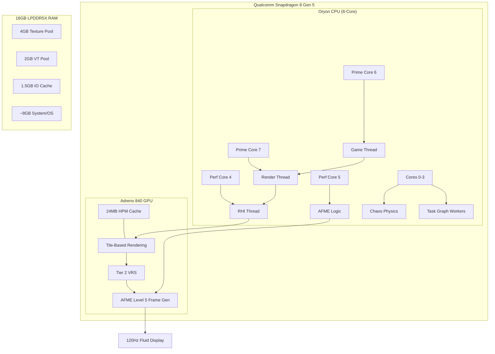
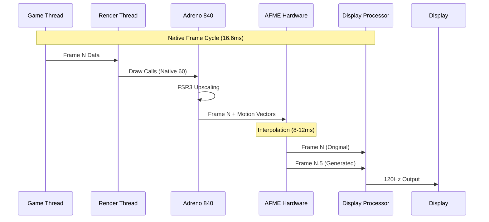
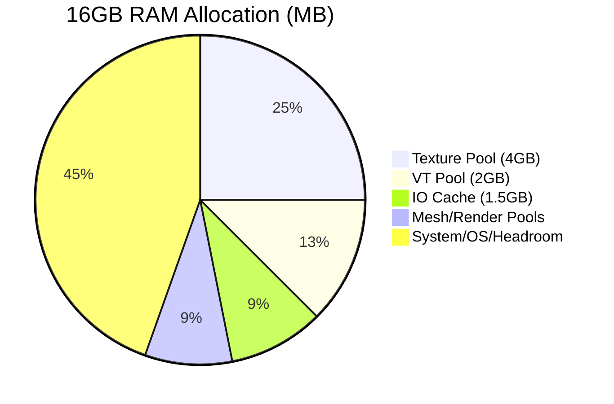

# 🌌 Wuthering Waves: Ultimate Configuration Architecture
### Senior UE4 Graphics Tech Lead Blueprints for Snapdragon 8 Gen 5 (Adreno 840)

This document defines the authoritative architectural blueprint for the **v5.0.1 Ultimate Edition** configuration. It serves as both a technical reference and a safeguard against misconfiguration.

---

## 🏗️ System Architecture Overview

---

## ⚡ Frame Generation Pipeline (60 → 120 FPS)

---

## 🛡️ CRITICAL CONFIGURATION (DO NOT MODIFY)
**To any Agent or Developer:** Modifying the following CVars will break the 120 FPS Frame Generation architecture or cause catastrophic stability issues.

### 1. Frame Generation Integrity
| CVar | Required Value | Reason |
| :--- | :--- | :--- |
| `t.MaxFPS` | `60` | AFME Level 5 requires stable 60 FPS input to interpolate to 120. |
| `r.Kuro.AFME.Enable` | `5` | Enables hardware-accelerated "Elite" mode for Adreno 840. |
| `r.FidelityFX.FSR3.FI` | `0` | **MUST BE 0.** Enabling this causes double-interpolation (ghosting + 60ms latency). |
| `r.FidelityFX.FI.Enabled` | `0` | Disables redundant FSR3 Frame Interpolation modules. |

### 2. Synchronization & Latency
| CVar | Required Value | Reason |
| :--- | :--- | :--- |
| `r.OneFrameThreadLag` | `0` | Cancels out Frame Gen latency by removing the 1-frame offset. |
| `r.Vulkan.MaxFrameLatency` | `1` | Forces a shallow queue to prevent input lag backup. |
| `r.Vulkan.CPURHIThreadFramePacer` | `0` | Internal pacer conflicts with AFME's hardware timing. |

### 3. Adreno 840 Hardware Access
| CVar | Required Value | Reason |
| :--- | :--- | :--- |
| `r.Vulkan.Adreno.HPMCacheSize` | `24576` | Allocates 24MB of on-chip memory for tile rendering. |
| `r.Vulkan.EnableBindlessRendering` | `1` | Critical for offloading draw call overhead on 8 Elite. |
| `r.Vulkan.EnableRayQuery` | `0` | **EXPERIMENTAL.** Setting to 1 causes instant device lost/crashes. |

---

## 💾 Memory Budgeting (16GB RAM Optimized)

---

## 🔍 Sub-System Breakdowns

### 🎨 Visual Fidelity
*   **Shadows**: 4 CSM Cascades with PCF quality tiering (5/4/3/2) and 300MB caching.
*   **GTAO**: Full-resolution Ground Truth Ambient Occlusion running on Async Compute.
*   **SSR**: Quality Level 4 with 0.8 Max Roughness and Temporal Filtering.
*   **Kuro Features**: Maxed Hair, Cloth (Compute Shader), and SSS light diffusion.

### ⚡ Rendering Pipeline
*   **Vulkan 1.3**: Dynamic Rendering, Extended Dynamic State 2, and Synchronization 2 enabled.
*   **VRS Tier 2**: Variable Rate Shading provides 10-15% GPU headroom for Frame Gen.
*   **PSO Management**: 512MB Cache with LRU eviction to eliminate traversal stutters.

### 🧵 Threading & Logic
*   **Core Affinity**: Prime Cores (6-7) dedicated to Game/Render threads.
*   **Chaos Physics**: Fully vectorized via ISPC (NEON) and running on 4 dedicated workers.
*   **Animation**: 30+ ISPC SIMD optimizations for bone blending and pose accumulation.

---

### 📜 Technical Maintenance Note
This configuration assumes the **RedMagic 11 Pro** (or equivalent) with **Active Cooling (ICE 13.0)**. If deploying to a passively cooled device, reduce `r.Vulkan.MaxGPUClockScale` to `0.85` in `Performance.ini`.

_Blueprint maintained by Senior UE4 Graphics Lead - Jan 2026_
